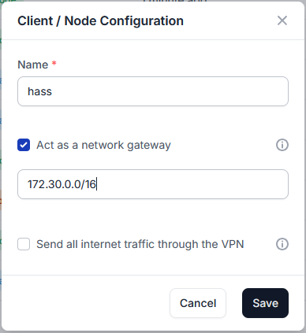
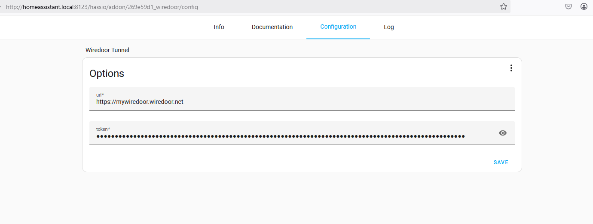

# Wiredoor Tunnel Add-on for Home Assistant

Securely expose your Home Assistant instance to the internet using [Wiredoor](https://github.com/wiredoor/wiredoor). A fully self-hosted, open-source ingress-as-a-service platform based on WireGuard and NGINX.

> **No port forwarding or cloud dependency required.**
> Works on `aarch64`, `amd64`, and `armv7` architectures.

---

## 🚀 Features

- Expose your Home Assistant instance over HTTPS securely
- Includes built-in `wiredoor-cli` for seamless connection
- Very low resource usage
- Fully open-source and self-hosted

---

## 🔧 Requirements

Before using this add-on, make sure you have:

1. Access to a running **Wiredoor Server** ([GitHub](https://github.com/wiredoor/wiredoor), [Website](https://www.wiredoor.net))
2. A **gateway node** created for Home Assistant, with the proper **subnet** to reach `homeassistant`
3. The **subnet `172.30.0.0/16`** added to `trusted_proxies` in your Home Assistant `configuration.yaml`



```yaml
http:
  use_x_forwarded_for: true
  trusted_proxies:
    - 172.30.0.0/16
```

---

## ⚙️ Installation

1. Add this add-on repository to your Home Assistant instance: [https://github.com/wiredoor/home-assistant-wiredoor-addon](https://github.com/wiredoor/home-assistant-wiredoor-addon)
2. Install the **Wiredoor Tunnel** add-on from the list.
3. Configure the following two options:

```yaml
url: "https://your-wiredoor-server.com"
token: "your-gateway-node-token"
```



4. Start the add-on. It will establish a secure WireGuard tunnel.

## 🌐 Exposing Home Assistant

Once the tunnel is connected, go to your Wiredoor dashboard and expose a service:

- Domain: `myhass.example.com`
- Target: `homeassistant:8123`

Then, optionally, set the `external_url` in your Home Assistant `configuration.yamls`:

```ymal
homeassistant:
  external_url: "https://myhass.example.com"
```

## ❓ Need Help?

📖 Full Documentation: [See Docs tab](https://github.com/wiredoor/home-assistant-wiredoor-addon/blob/main/wiredoor/DOCS.md)

🔗 Wiredoor Project: [www.wiredoor.net](https://www.wiredoor.net) | [GitHub](https://github.com/wiredoor/wiredoor)

## License

MIT License
