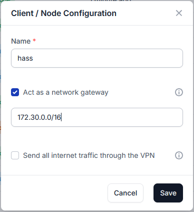
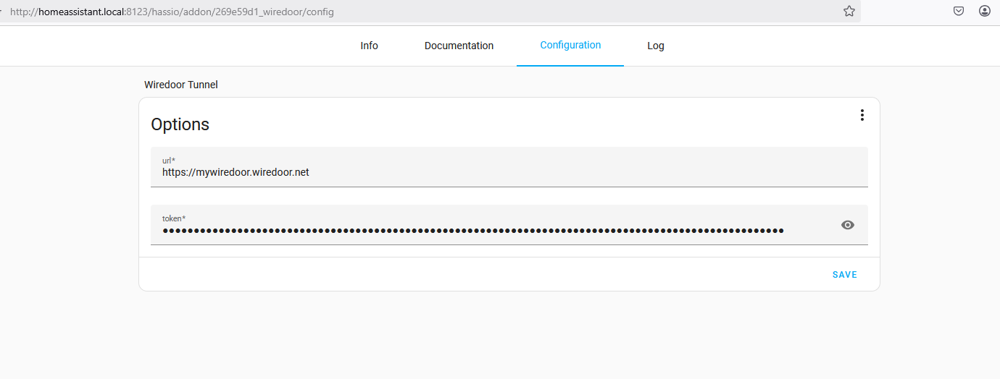
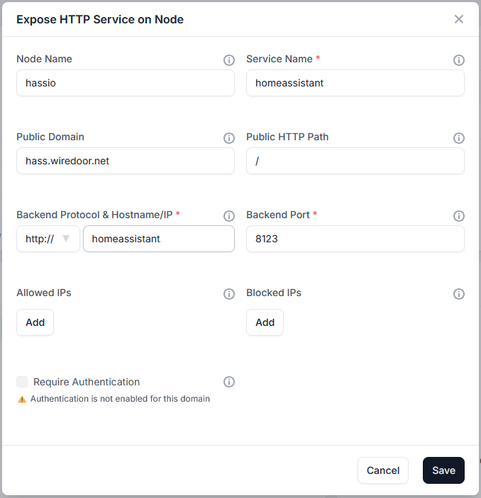

# Wiredoor Home Assistant Add-on documentation

This add-on connects your Home Assistant instance to a **Wiredoor** gateway node, enabling secure HTTPS exposure to the internet without needing a public IP, router configuration, or NAT traversal hacks.

---

## 🛠 Requirements

Before using this add-on, you must:

1. Deploy a **Wiredoor Server** (see [Wiredoor GitHub](https://github.com/wiredoor/wiredoor) or [Quickstart Guide](https://www.wiredoor.net/docs/quickstart)).
2. Create a **gateway node** from the Wiredoor Dashboard.
3. Set the **target subnet of the node** to include the IP used by Home Assistant, e.g., `172.30.32.0/23` or `172.30.0.0/16`



---

## 🔐 Home Assistant Configuration

To ensure Home Assistant accepts requests forwarded through Wiredoor, update your `configuration.yaml`:

```yaml
http:
  use_x_forwarded_for: true
  trusted_proxies:
    - 172.30.33.0/24
```

🔧 Add-on Setup

1. Open the **Configuration** tab of the add-on.
2. Set:



```yaml
url: "https://your-wiredoor-server.com"
token: "your-gateway-node-token"
```

## 🌍 Expose Home Assistant

In your Wiredoor Dashboard:

1. Go to your created gateway node for Home Assistant
2. Expose new service and Set:

- **Service Name**: `homeassistant`
- **Public Domain**: `myhass.example.com`
- **Backend Protocol & Hostname/IP**: `http://homeassistant.local`
- **Backend Port**: `8123`



You can also expose other services (like ESPHome, Node-RED) if they're reachable from the Wiredoor subnet.

## 🌐 Optional: Set `external_url`

You can enhance functionality by setting the public domain in your Home Assistant config:

```yaml
homeassistant:
  external_url: "https://myhass.example.com"
```

This enables accurate redirects and better integration with some features (e.g. mobile apps).

## 💬 Troubleshooting

- **400 or 403 errors**: Make sure `trusted_proxies` is correctly configured. If you change the `configuration.yaml` file, make sure you restart home assistant.
- **No connection**: Check the logs of the add-on. It should show `Connected to Wiredoor Server`.
- **Wrong service IP**: Ensure your Wiredoor gateway subnet includes the IP of `homeassistant.local`.

## 🧠 FAQ

### Can I expose other add-ons like Node-RED or ESPHome?

Yes, if those services are reachable in the same subnet (e.g., `172.30.0.0/16`), you can expose them too via Wiredoor.

### Do I need to open ports on my router?

No. Wiredoor creates an outbound WireGuard tunnel from your Home Assistant to your Wiredoor server.

### Is Wiredoor free and open source?

Yes! Visit [https://github.com/wiredoor](https://github.com/wiredoor) for all repos and licensing.

---

For more help, visit the [official documentation](https://www.wiredoor.net/docs/) or open an issue in the [GitHub repo](https://github.com/wiredoor/wiredoor).
